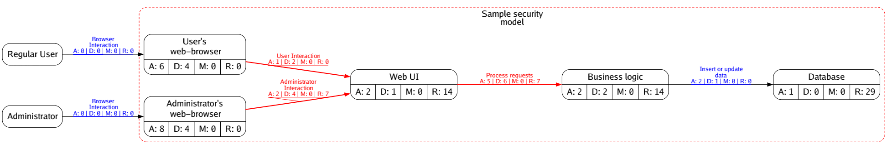

# Security Report: Sample security model

This report contains

* Existing mitigations implemented in specific entities/flows in this security model.
* Security recommendations for specific entities/flows in this security model.
* A list of un-mitigated risks for specific entities/flows.

## Security Model

The Attack-Defense Graph for this model is available as a [graphviz file](resources/Sample_security_model.adm.dot). Please use a graphviz viewer or use [graphviz CLI tool](https://graphviz.org/download/) to export it to an image format of your choice. In case of CLI tool use `dot -Tpng resources/Sample_security_model.adm.dot` to generate a PNG image of the graph. Detailed user documentation for CLI tool is available [here](https://graphviz.org/doc/info/command.html).

## Risks

This section lists all ADM attacks that have not been mitigated.

* Force deletion of sensitive and critical data (under `flows → process-requests`)
* TLS cipher problems (under `sm`)
* Inject javascript into client webpage (under `flows → user-interaction`)
* Inject javascript into client webpage (under `flows → admin-interaction`)

## Recommendations

This section lists general security recommendations for specific entities/flows in this security model.

### Entities

#### Web UI

* (`Web UI -> Language:Go`) Maintain an allowlist of domains when processing input strings that contain URIs. Uncontrolled URIs can lead to XSS (Cross Site Scripting) vulnerabilities.
* (`Web UI -> Language:Go`) If you use string inputs to calculate file paths, make sure you sanitize them to avoid path-traversal attacks. 
One way to do this is to look for `./`, `../` or presence of common shell environment variables (like `$HOME`) in input strings.

* (`Web UI -> Language:Go`) When string inputs are used to calculate file paths, make sure spaces are escaped appropriately to avoid truncation of file paths, which enables file-traversal attacks.
* (`Web UI -> Language:Go`) Use go standard [crypto](https://pkg.go.dev/crypto) packages
* (`Web UI -> Language:Go`) Protect users from cross-site scripting (XSS) attacks by automatically encoding web content using the [html/template](https://pkg.go.dev/html/template) rather than simply outputting plain text, as the `text/template` package would do.
* (`Web UI -> Language:Go`) Avoid spawning a shell from code. If you absolutely have to do it, sanitize all inputs before using it in the shell / sub-shell.
* (`Web UI -> Language:Go`) Avoid `unsafe` and `cgo` packages, as they permit developers to break out of Go's type-safety restrictions and their use could potentially enable attackers to break Go's memory safety.
* (`Web UI -> Language:Go`) Use reflection sparingly. Reflection can be a powerful tool, but with Go's typing and interface system, it should be rarely used as it can easily cause unexpected problems.
* (`Web UI -> Language:Go`) In containers, utilize Go's static binding capabilities in conjunction with minimal base images to reduce the effective filesystem to a minimum.
* (`Web UI -> Language:Go`) When building SQL statements or URLs, sanitize input to avoid remote code execution. Alternately, instead of using `database/sql`, use `github.com/jmoiron/sqlx` for DB operations. SQLx performs input sanitization before building queries.
* (`Web UI -> Language:Go`) When storing keys in memory, use libraries like [memguard](https://github.com/awnumar/memguard) to encrypt them in memory. This helps mitigate memory scanning and analysis tools used by attackers.
* (`Web UI -> Language:Go`) Verify source URL when importing packages directly from github or other online repositories. Use tools like [chainjacking](https://github.com/Checkmarx/chainjacking) to scan all your sources for such risks.
* (`Web UI -> Language:Go`) Always use latest, patched version of external libraries.
* (`Web UI -> Language:Go`) Scan all dependencies using tools like Snyk or GitHub's Dependabot to identify CVEs that may lead to vulnerabilities in your program.

#### Database

* (`Database -> (Base)MySQL Database:MySQL Database -> (Base)Database Server:Database Server`) Use built-in encryption support provided by DB to secure data at-rest.
* (`Database -> (Base)MySQL Database:MySQL Database -> (Base)Database Server:Database Server`) Never expose DB directly to end-users or Internet.
* (`Database -> (Base)MySQL Database:MySQL Database -> (Base)Database Server:Database Server`) DB should expose two interfaces - SQL and DB API. SQL should only be used by admins and analysts. API is for programs.
* (`Database -> (Base)MySQL Database:MySQL Database -> (Base)Database Server:Database Server`) DB API that accept SQL query strings should not be used by applications to access data.
* (`Database -> (Base)MySQL Database:MySQL Database -> (Base)Database Server:Database Server`) You should not store credentials in connection strings.
* (`Database -> (Base)MySQL Database:MySQL Database -> (Base)Database Server:Database Server`) Use TLS for all connections if database supports it.
* (`Database -> (Base)MySQL Database:MySQL Database -> (Base)Database Server:Database Server`) Each unique program accessing this database should get a separate DB account.
* (`Database -> (Base)MySQL Database:MySQL Database -> (Base)Database Server:Database Server`) DB access-control should be per-table. Don't give a blanket "all tables" access to any user account.
* (`Database -> (Base)MySQL Database:MySQL Database -> (Base)Database Server:Database Server`) Don't use default credentials supplied by DB.
* (`Database -> (Base)MySQL Database:MySQL Database -> (Base)Database Server:Database Server`) Each administrator should get their own DB account. This helps with accountability and forensic analysis. These accounts must be restricted to interactive use only.
* (`Database -> (Base)MySQL Database:MySQL Database -> (Base)Database Server:Database Server`) If there are multiple admins, break up DB privileges into smaller subsets where possible. 
For example, a subset of admins are only allowed to manage databases and associated user accounts while another subset is only allowed backup and archival privileges. 
This helps separate privileged operations and increases the effort required for an attacker to gain full access to the database.

* (`Database -> (Base)MySQL Database:MySQL Database -> (Base)Database Server:Database Server`) Use separate accounts for interactive interfaces (like SQL clients) and API.
* (`Database -> (Base)MySQL Database:MySQL Database -> (Base)Database Server:Database Server`) Enforce SSO and other multi-factor authentication standards for interactive accounts.
* (`Database -> (Base)MySQL Database:MySQL Database -> (Base)Database Server:Database Server`) Use non-username-password authentication mechanisms for API.
* (`Database -> (Base)MySQL Database:MySQL Database -> (Base)Database Server:Database Server`) Enforce table level C.R.U.D. rights on all accounts.
* (`Database -> (Base)MySQL Database:MySQL Database -> (Base)Database Server:Database Server`) Use separate "reader" and "writer" accounts. Even if an application/service requires full C.R.U.D. rights, separating accounts based on specific operations forces applications to use more than one credential to complete its task.
* (`Database -> (Base)MySQL Database:MySQL Database -> (Base)Database Server:Database Server`) Evaluate whether an account requires "Delete" rights. It is a good design practice to not delete any records, especially if the DB is transactional in nature.
* (`Database -> (Base)MySQL Database:MySQL Database -> (Base)Database Server:Database Server`) Avoid direct access to tables and built-in SQL functions. Instead use views and stored-procedures to access data.
* (`Database -> (Base)MySQL Database:MySQL Database -> (Base)Database Server:Database Server`) Instead of executing SQL procedures on DB, use stored procedures. These procedures should sanitize all inputs before using them in queries.
* (`Database -> (Base)MySQL Database:MySQL Database -> (Base)Database Server:Database Server`) Ensure stored procedures sanitize their inputs i.e., replace symbols in input strings with associated escape chararacters.
* (`Database -> (Base)MySQL Database:MySQL Database -> (Base)Database Server:Database Server`) DB views can also be used for access control. 
For example, two views on the same table can be created, one for regular user and another for admins, both with different filter parameters. 
This also helps avoid reading some of the filter parameters from input / SQL query.

* (`Database -> (Base)MySQL Database:MySQL Database -> (Base)Database Server:Database Server`) All key decisions made by the DB server should be logged. This helps with forensic analysis in case of a breach.
* (`Database -> (Base)MySQL Database:MySQL Database -> (Base)Database Server:Database Server`) Make sure logging system is configured to not store any data from the database. This help avoid data leakage (specifically PII).
* (`Database -> (Base)MySQL Database:MySQL Database -> (Base)Database Server:Database Server`) Never allow log modification.
* (`Database -> (Base)MySQL Database:MySQL Database -> (Base)Database Server:Database Server`) Make sure DB Server and its storage is set up to handle peak traffic and large request spikes. 
This helps when DoS attacks end up impacting traffic to databases.
If you are using honeypots to handle DoS attacks, include a database too in the honeypot to help deflect the attack.

* (`Database -> (Base)MySQL Database:MySQL Database -> (Base)Database Server:Database Server`) Database backups should be secured as much as (or more than) the primary database.
Attackers always take the path of least resistance. 
They can target DB backups when they cannot gain access to primary DB. 
Make sure access control rules for backups are stricter than those used in production. 
For example, backups can be configured to be accessible only to a sub-set of admins only.

* (`Database -> (Base)MySQL Database:MySQL Database -> (Base)Database Server:Database Server`) Make sure DBs always span across availability zones and if possible across geographical regions.
This helps mitigate impact of singular or smaller scale failures.

* (`Database -> Language:SQL`) SQL clients should sanitize all inputs before building queries. 
Sanitization involves replacing harmful symbols, those that have syntactic meaning in SQL with associated escape characters.

* (`Database -> Language:SQL`) SQL was created for humans. DB API are for programs. 
Use ORM / Entity Frameworks from your specific programming language to directly load and filter DB data, instead of using SQL queries. 
If ORM is not possible, use prepared-statements instead of plain SQL query strings.
All major programming languages have packages/libraries to help create prepared-statements.

#### Business logic

* (`Business logic -> Language:Go`) Maintain an allowlist of domains when processing input strings that contain URIs. Uncontrolled URIs can lead to XSS (Cross Site Scripting) vulnerabilities.
* (`Business logic -> Language:Go`) If you use string inputs to calculate file paths, make sure you sanitize them to avoid path-traversal attacks. 
One way to do this is to look for `./`, `../` or presence of common shell environment variables (like `$HOME`) in input strings.

* (`Business logic -> Language:Go`) When string inputs are used to calculate file paths, make sure spaces are escaped appropriately to avoid truncation of file paths, which enables file-traversal attacks.
* (`Business logic -> Language:Go`) Use go standard [crypto](https://pkg.go.dev/crypto) packages
* (`Business logic -> Language:Go`) Protect users from cross-site scripting (XSS) attacks by automatically encoding web content using the [html/template](https://pkg.go.dev/html/template) rather than simply outputting plain text, as the `text/template` package would do.
* (`Business logic -> Language:Go`) Avoid spawning a shell from code. If you absolutely have to do it, sanitize all inputs before using it in the shell / sub-shell.
* (`Business logic -> Language:Go`) Avoid `unsafe` and `cgo` packages, as they permit developers to break out of Go's type-safety restrictions and their use could potentially enable attackers to break Go's memory safety.
* (`Business logic -> Language:Go`) Use reflection sparingly. Reflection can be a powerful tool, but with Go's typing and interface system, it should be rarely used as it can easily cause unexpected problems.
* (`Business logic -> Language:Go`) In containers, utilize Go's static binding capabilities in conjunction with minimal base images to reduce the effective filesystem to a minimum.
* (`Business logic -> Language:Go`) When building SQL statements or URLs, sanitize input to avoid remote code execution. Alternately, instead of using `database/sql`, use `github.com/jmoiron/sqlx` for DB operations. SQLx performs input sanitization before building queries.
* (`Business logic -> Language:Go`) When storing keys in memory, use libraries like [memguard](https://github.com/awnumar/memguard) to encrypt them in memory. This helps mitigate memory scanning and analysis tools used by attackers.
* (`Business logic -> Language:Go`) Verify source URL when importing packages directly from github or other online repositories. Use tools like [chainjacking](https://github.com/Checkmarx/chainjacking) to scan all your sources for such risks.
* (`Business logic -> Language:Go`) Always use latest, patched version of external libraries.
* (`Business logic -> Language:Go`) Scan all dependencies using tools like Snyk or GitHub's Dependabot to identify CVEs that may lead to vulnerabilities in your program.
### Flows

#### Administrator Interaction

* (`Administrator Interaction -> Protocol:HTTPS -> Protocol:HTTP`) Ensure that both communicating parties authenticate each other before sending sensitive data. Authentication can involve client keys or SSO.
* (`Administrator Interaction -> Protocol:HTTPS -> Protocol:HTTP`) Ensure all requests and responses are logged.
* (`Administrator Interaction -> Protocol:HTTPS -> Protocol:HTTP`) Force same-origin policy when transmitting data to client.
* (`Administrator Interaction -> Protocol:HTTPS -> Protocol:HTTP`) Logs should include client identifier (ID, IP address, etc.), user agent (if applicable), HTTP method and status code, host URL/endpoint, HTTP GET query parameters, request size, unique ID of the request, referrer (if applicable) and time of request.
* (`Administrator Interaction -> Protocol:HTTPS -> Protocol:TLS`) Avoid weak ciphers
* (`Administrator Interaction -> Protocol:HTTPS -> Protocol:TLS`) Ensure key TLS negotiation decisions are logged.
* (`Administrator Interaction -> Protocol:HTTPS`) Use HSTS to enforce HTTPS for all connections

#### Process requests

* (`Process requests -> Protocol:HTTPS`) Use HSTS to enforce HTTPS for all connections
* (`Process requests -> Protocol:HTTPS -> Protocol:HTTP`) Ensure that both communicating parties authenticate each other before sending sensitive data. Authentication can involve client keys or SSO.
* (`Process requests -> Protocol:HTTPS -> Protocol:HTTP`) Ensure all requests and responses are logged.
* (`Process requests -> Protocol:HTTPS -> Protocol:HTTP`) Force same-origin policy when transmitting data to client.
* (`Process requests -> Protocol:HTTPS -> Protocol:HTTP`) Logs should include client identifier (ID, IP address, etc.), user agent (if applicable), HTTP method and status code, host URL/endpoint, HTTP GET query parameters, request size, unique ID of the request, referrer (if applicable) and time of request.
* (`Process requests -> Protocol:HTTPS -> Protocol:TLS`) Avoid weak ciphers
* (`Process requests -> Protocol:HTTPS -> Protocol:TLS`) Ensure key TLS negotiation decisions are logged.
