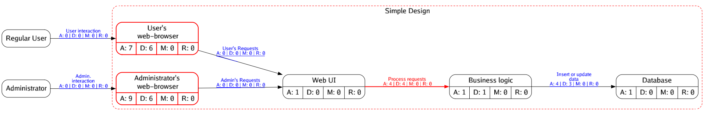

# Security Report: Simple Design

This report contains

* Existing mitigations implemented in specific entities/flows in this security model.
* Security recommendations for specific entities/flows in this security model.
* A list of un-mitigated risks for specific entities/flows.

## Security Model

The Attack-Defense Graph for this model is available as a [graphviz file](resources/Simple_Design.adm.dot). Please use a graphviz viewer or use [graphviz CLI tool](https://graphviz.org/download/) to export it to an image format of your choice. In case of CLI tool use `dot -Tpng resources/Simple_Design.adm.dot` to generate a PNG image of the graph. Detailed user documentation for CLI tool is available [here](https://graphviz.org/doc/info/command.html).

## Risks

This section lists all ADM attacks that have not been mitigated.

* Force deletion of sensitive and critical data (under `flows → process-requests`)
* Inject javascript into client webpage (under `entities → user-browser`)
* Inject javascript into client webpage (under `entities → admin-browser`)
